# Identity-Lifecycle-Joiner-Mover-Leaver-Automation-Project

# Identity Lifecycle Engine

> PowerShell automation for the full identity lifecycle — **Joiner, Mover, Leaver** — across a hybrid **Active Directory + Microsoft Entra ID** environment, with role-based provisioning, privilege-creep reconciliation, and identity governance reporting.

---

## Table of Contents
- [Overview](#overview)
- [Why This Project](#why-this-project)
- [What It Demonstrates](#what-it-demonstrates)
- [Architecture](#architecture)
- [Features](#features)
- [Key Design Decisions](#key-design-decisions)
- [Tech Stack](#tech-stack)
- [Repository Structure](#repository-structure)
- [Concepts Glossary](#concepts-glossary)

---

## Overview

The **Identity Lifecycle Engine** is a modular PowerShell system that automates the day-to-day work of an Identity & Access Management (IAM) team: it provisions new employees with the correct access, reconciles access when they change roles, deprovisions them cleanly when they leave, and produces the governance reports auditors ask for — all with a shared audit-logging layer that records every action.

It runs on a self-built **hybrid identity lab**: an on-premises Windows Server Active Directory domain (`corp.lab`) synchronized to a **Microsoft Entra ID** tenant via Entra Connect. Every lifecycle action is performed on-premises in AD and flows automatically to the cloud, mirroring how identity is managed in the majority of enterprise environments.

> **About this project:** This is a hands-on lab I built to learn and demonstrate hybrid IAM engineering — not production experience. It implements the same patterns (RBAC, JML automation, least privilege, identity governance) used in production identity systems, in a controlled environment I designed end to end.

---

## Why This Project

In most organizations, three identity events happen constantly, and each is a security risk when handled poorly:

- **Joiner** — a new hire needs access on day one. Manual provisioning is slow and inconsistent.
- **Mover** — someone changes departments. The common mistake is *adding* their new access while leaving the old access in place. Over time, people accumulate permissions to everything — **privilege creep**, one of the most frequent audit findings.
- **Leaver** — someone departs. Access left enabled after an employee leaves is a textbook attack vector.

On top of that, auditors regularly ask *"who has access to what, and why?"* — and most teams struggle to answer quickly.

This engine solves all four problems: consistent role-based onboarding, a mover process that **removes stale access rather than only adding new access**, complete offboarding that respects the source of authority, and on-demand governance reporting.

---

## What It Demonstrates

**Identity engineering**
- Automated Joiner / Mover / Leaver (JML) lifecycle in PowerShell
- Role-Based Access Control (RBAC) provisioning driven by a central role map
- Privilege-creep reconciliation (removing access a role should no longer have)
- Hybrid identity: on-premises Active Directory synchronized to Microsoft Entra ID
- Source-of-authority–aware deprovisioning
- Live cloud session revocation via Microsoft Graph

**Identity governance (IGA / GRC)**
- Access certification reporting for access reviews
- Orphaned / stale account detection
- Separation-of-Duties (SoD) "toxic combination" checks
- Full CSV audit trail of every action taken

**Engineering practice**
- Modular design: a shared module of reusable functions, composed into discrete lifecycle components
- Idempotent, guardrailed operations (safe to re-run; protected accounts cannot be touched)
- State capture before destructive actions (auditability and reversibility)

---

## Architecture

The system is built as a **shared foundation** with **lifecycle components** and a **governance layer** composed on top — the structural choice that makes this a system rather than three loose scripts.

```mermaid
flowchart TB
    M["IdentityCommon.psm1<br/>Shared audit logging + RBAC role map"]

    M --> J["Invoke-Joiner<br/>Role-based provisioning"]
    M --> V["Invoke-Mover<br/>Access reconciliation"]
    M --> L["Invoke-Leaver<br/>Deprovisioning + state capture"]
    M --> G["Governance Reports<br/>Certification · Orphaned · SoD"]

    J --> AD[("Active Directory&#10;corp.lab")]
    V --> AD
    L --> AD
    G -. reads .-> AD

    AD ==>|"Entra Connect (delta sync)"| E[("Microsoft Entra ID")]
```



- **`IdentityCommon.psm1`** — the foundation. A `Write-IAMLog` function that records every action to a CSV audit trail, and a `Get-RoleGroups` function that defines the RBAC model (which security groups each department receives).
- **Lifecycle components** — three scripts (`Invoke-Joiner`, `Invoke-Mover`, `Invoke-Leaver`) that import the module and perform lifecycle operations against Active Directory.
- **Governance layer** — reporting scripts that read the current state of the directory to produce audit-ready artifacts.
- **Hybrid flow** — all changes are written to AD, then synchronized to Entra ID, because AD is the source of authority for synced identities.

---

## Features

### Joiner — role-based provisioning
Creates a new employee account and automatically grants the correct security groups for their department based on the central RBAC role map. Includes a guardrail that skips creation if the account already exists, and optionally sets the user's manager. New accounts sync to Entra ID automatically.

### Mover — access reconciliation *(the differentiator)*
When an employee changes departments, the engine **reconciles** their access instead of simply adding to it:

```powershell
# Remove: groups they currently hold, that the role model governs,
#         that the NEW role should NOT have  (this prevents privilege creep)
$toRemove = $currentGroups | Where-Object { $_ -in $governedGroups -and $_ -notin $targetGroups }

# Add: groups the new role requires that they don't already have
$toAdd    = $targetGroups  | Where-Object { $_ -notin $currentGroups }
```

The result: the user gains their new access **and loses the access their old role shouldn't retain**, while shared access is preserved. Most automated movers omit the removal half — which is exactly why audits find users carrying years of accumulated permissions.

### Leaver — source-of-authority–aware deprovisioning
Fully offboards a departing employee:
1. **Captures a snapshot** of their access first (audit evidence and a reversal safety net)
2. **Disables the account in Active Directory** — the source of authority for synced users
3. **Removes all group memberships**
4. **Files the account** in a dedicated Disabled OU
5. **Optionally revokes live cloud sessions** immediately via Microsoft Graph

A guardrail blocks built-in/critical accounts (`administrator`, `krbtgt`, `guest`) from ever being offboarded.

### Governance layer — audit-ready reporting
- **Access Certification Report** — every employee, their department, manager, status, and exact access, exported for a reviewer to sign during an access review.
- **Orphaned Account Detection** — flags enabled accounts that are stale (no logon in 90 days) or have no manager assigned.
- **Separation-of-Duties Check** — flags any user holding a conflicting combination of access (e.g., both financial-reporting and IT-admin privileges).

---

## Key Design Decisions

These are the choices that reflect *understanding* of identity management, not just scripting:

**Lifecycle operations happen in Active Directory and flow to the cloud.**
In a hybrid environment, synced identities are authored on-premises. Making changes in AD (and letting them sync) respects the source of authority. Disabling an account *only* in the cloud portal would be reversed on the next sync cycle.

**The Mover removes access, it doesn't only add it.**
Enforcing least privilege on role change is the entire point of a mover process. Reconciling to the target role's access set — removing what's no longer appropriate — is what prevents privilege creep.

**The Leaver captures state before making changes.**
Recording what a user had *before* deprovisioning provides audit evidence and a reversal path (e.g., a contractor who returns), which is why the snapshot is step one, before anything is disabled or removed.

**Operations are guardrailed and idempotent.**
Critical accounts are protected from offboarding, existing users aren't recreated, and re-running an operation won't produce duplicate or destructive results — the properties any automation touching identity must have.

---

## Tech Stack

| Area | Technology |
|---|---|
| Automation | Windows PowerShell |
| Directory | Active Directory Domain Services (Windows Server) |
| Cloud identity | Microsoft Entra ID |
| Directory sync | Microsoft Entra Connect |
| Cloud API | Microsoft Graph PowerShell SDK |
| Access model | Role-Based Access Control (RBAC) via security groups |
| Audit | CSV audit logging |

---

## Repository Structure

```
Identity-Lifecycle-Engine/
├── IdentityCommon.psm1              # Shared module: audit logging + RBAC role map
├── Setup-Structure.ps1              # Provisions OUs and security groups
├── Invoke-Joiner.ps1                # Joiner: role-based provisioning
├── Invoke-Mover.ps1                 # Mover: access reconciliation
├── Invoke-Leaver.ps1                # Leaver: deprovisioning + state capture
├── Get-AccessCertification.ps1      # Governance: access review report
├── Find-OrphanedAccounts.ps1        # Governance: stale/unowned account detection
├── Test-SeparationOfDuties.ps1      # Governance: toxic-combination check
```

---

## Concepts Glossary

| Term | Meaning |
|---|---|
| **JML** | Joiner / Mover / Leaver — the three core identity lifecycle events |
| **RBAC** | Role-Based Access Control — access granted by role rather than per-user |
| **Privilege creep** | The gradual accumulation of access a user no longer needs |
| **Source of authority** | The system that authoritatively owns an identity (here, on-prem AD for synced users) |
| **Access certification** | A periodic review where managers confirm who should have what access |
| **Orphaned account** | An enabled account that is stale or has no clear owner |
| **Separation of Duties (SoD)** | Preventing one person from holding a conflicting combination of privileges |

---

## Author

**Kadyn Finney**
· LinkedIn: `[<https://www.linkedin.com/in/kadyn-finney/>]`
